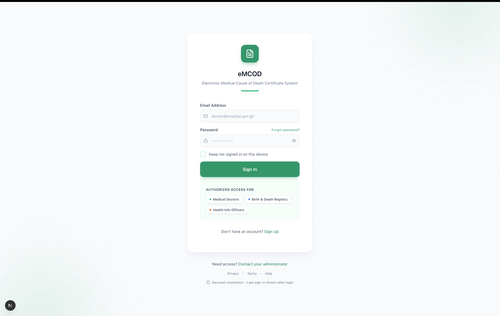
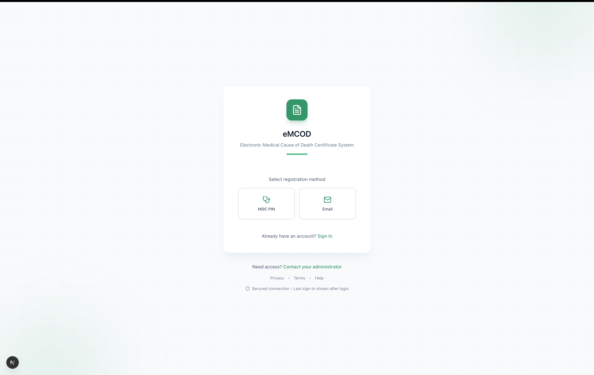
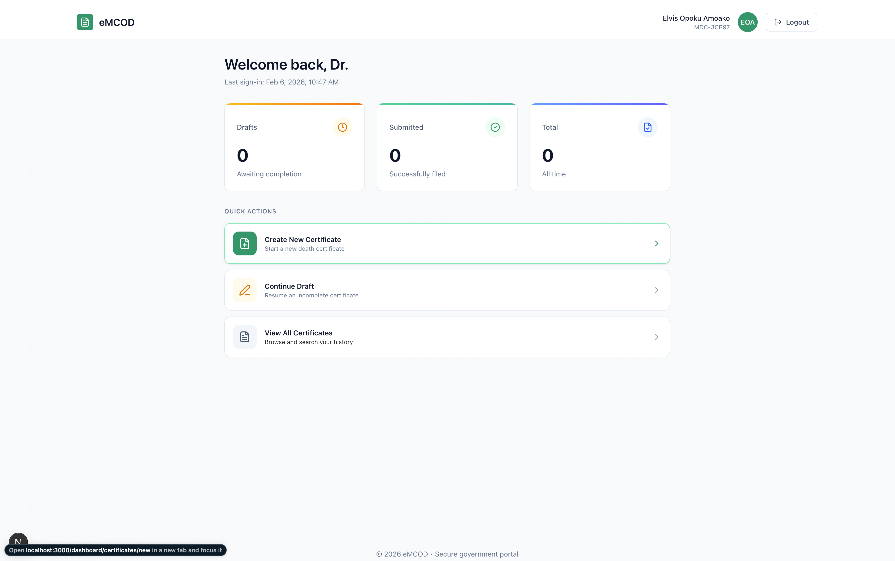
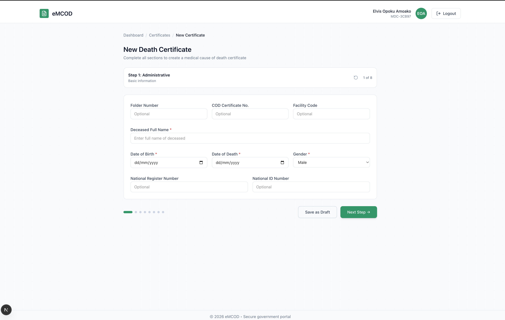
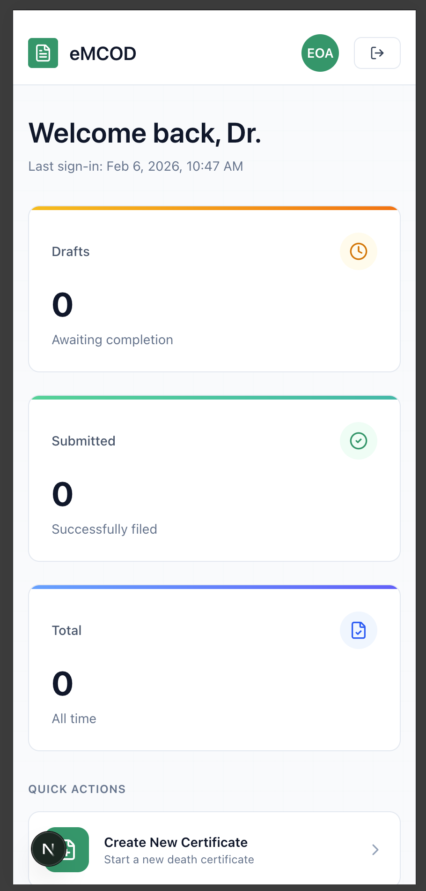
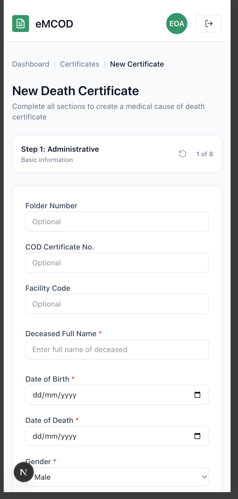

# eMCOD - Electronic Medical Cause of Death Certificate System

A web application for digitizing Ghana's Medical Cause of Death Certificate (Medical Form L, Section 30). Enables doctors to create, manage, and submit death certificates electronically.

## Screenshots

### Authentication

  
  &nbsp;&nbsp;
  

### Desktop

  
  &nbsp;&nbsp;
  

### Mobile

  
  &nbsp;&nbsp;&nbsp;&nbsp;
  

## Features

- Multi-step death certificate form (8 steps with validation)
- Role-based access control (Doctor, Registry, Health Department)
- Draft saving and 5-day edit window after submission
- Responsive design for mobile and desktop
- Supabase authentication with protected routes

## Tech Stack

| Layer | Technology |
|-------|------------|
| **Framework** | Next.js 16.1.1 (App Router) |
| **UI** | React 19, Tailwind CSS v4, shadcn/ui |
| **Auth & Database** | Supabase |
| **Forms** | React Hook Form + Zod |
| **Deployment** | Vercel |

## Contributing

See [CONTRIBUTING.md](CONTRIBUTING.md) for development setup, branch strategy, and code style guidelines.

## License

Private - All rights reserved.
